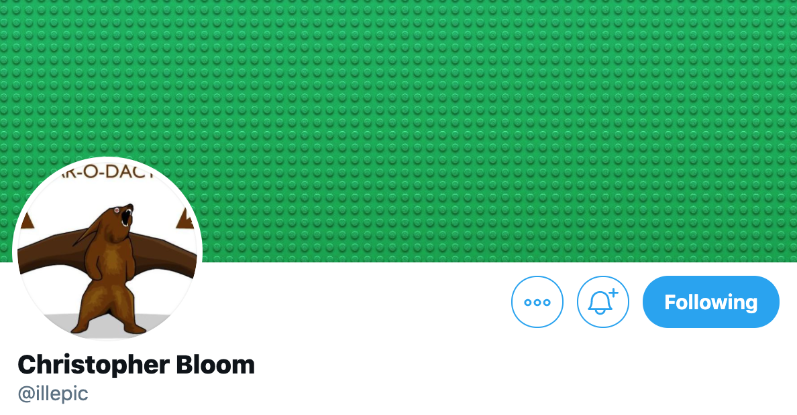
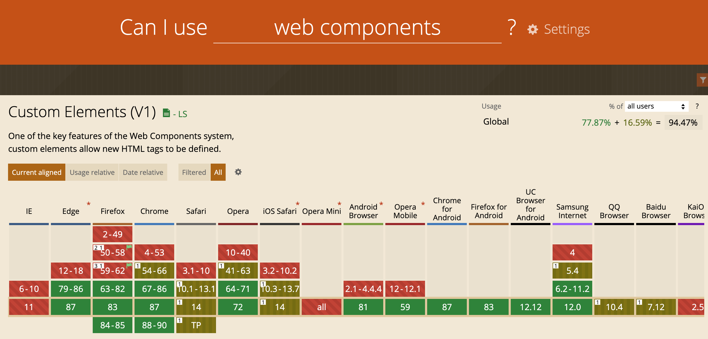
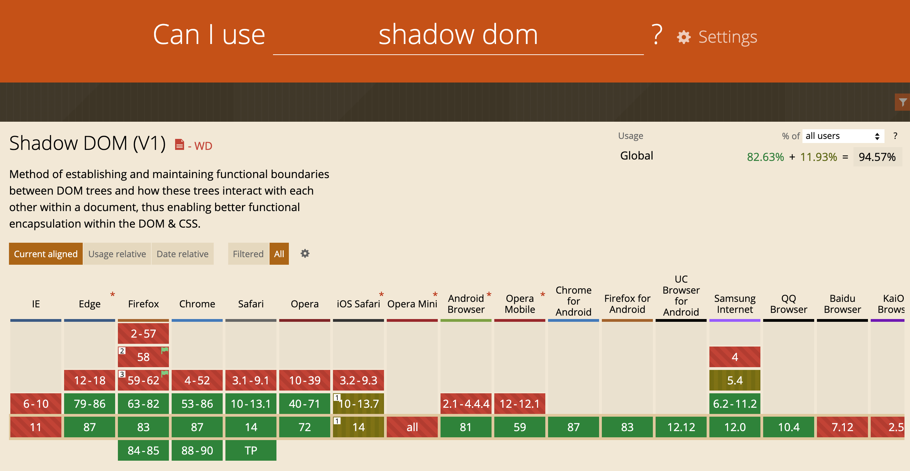
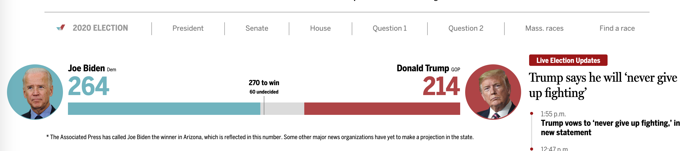
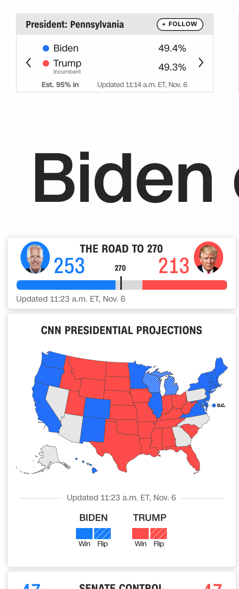
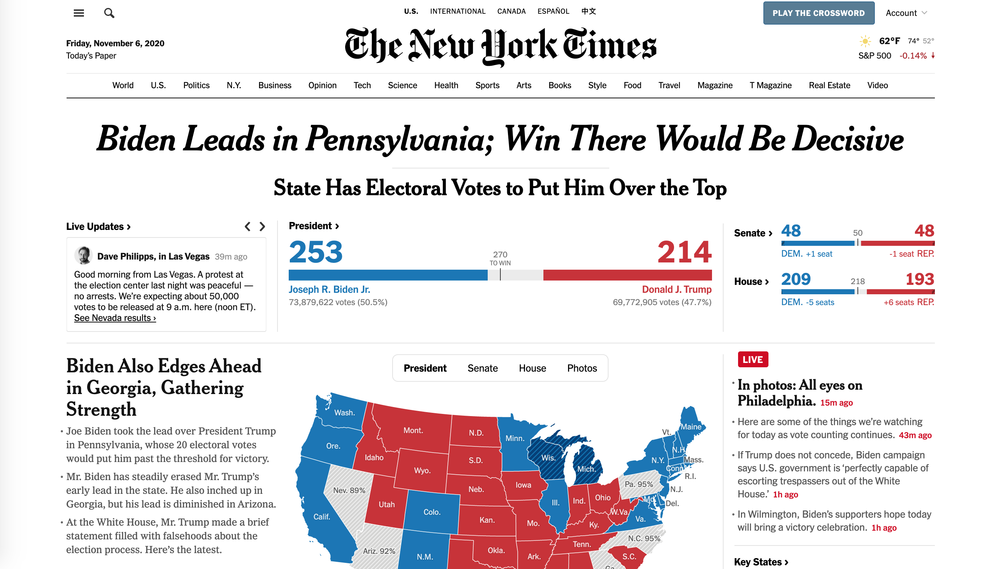

slide-transition: true
# **Web components** through the eyes
# of a newcomer
### Design 4 Drupal - December 2, 2020
### [https://bit.ly/d4dwc](https://bit.ly/d4dwc)

---

[.column]
## Brian Perry
* Lead Front End Dev at Bounteous
* Rocking the Chicago ‘burbs
* Lover of all things components... and Nintendo

[.column]

---

^ Special shout outs to Andy Olsen for helping me crack the code on this,
along with the NEDCamp BOF Session

---

# [fit] Components
# [fit] have taken over the web

---

# We're here to talk about
# [fit] Web
# [fit] Components

---

## [fit] Like React and Angular, right?

---
[.build-lists: true]

# Web components

__A set of web platform APIs__, not tied to a specific framework

* Custom elements
* Shadow DOM
* HTML Templates

---
# I :heart: components.
 
# So I should :heart: Web Components.
 
# So why aren't they part of my workflow? :cold_sweat:

---
# [fit] Warning: not an expert

---

# I look to:

[.column]

### @btopro

[.column]

### [fit] @salem_cobalt

[.column]

### [fit] @castastrophee

[.column]

### @illepic

---

## Can I Use Web Components? [^1]

[^1]: IE 11 can be supported using polyfills

---

# [fit] Can Can I Use Use Web Components? [^2]

[^2]: Find many more examples at https://wild.open-wc.org/

---

# I should build an example web component.
 
But what could be a relevant example in November 2020?

^ What have I been lookinga at forever... Show storybook gif

---

---

---

---

---

---

---

---

---

Storybook gif

---

# How would you use it?

* NPM Install the thing
* A custom element
* The Shadow DOM
  * Drop it into a MAGA style website

^ A codepen that uses it.

---

# Building The Election Tracker - Vanilla JS

* election tracker example

^ May need to experiment with <template> here to make code less awful.

---

# steps

* Hello world - just render text to the screen
  * Limitation - Sure would like to use templating
  * What happened to the template spec? Homework.
* Take in and render props
  * Limitation - attributes are only strings
* Re-render based on changes

---

# Compare Vanilla to Framework

Vanilla Pros:
* More browser native

Examples of boilerplate that framework takes care of

* Templating
* Parsing data types
* Observing properties

---

# So. Many. Frameworks.

Were web components even meant to be used without a framework?

---

# Rebuilding as Lit Element

* Lit Element
* Lit HTML

---
# Stencil

Quick look.

---

# Vue with web components as a compile target

^ examples that get to far from the spec. You still need to load vue

---

# Using web components with a framework

Didn't do my homework?

---

Why aren't I using web components

Why would I use web components.

---

# My more educated views on web components

I'd use a framework, but one that is pretty close to the spec.

On an infinite timescale, web components will win.

But how infinite? And will it be this version of Web Components?

^ I know how lit element converts to standard web component stuff if Google goes out of business.

---

Thanks / Q&A