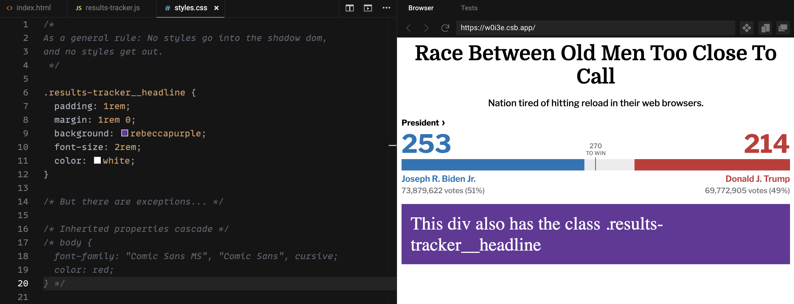

slide-transition: true
# **Web components** through the eyes
# of a newcomer
### Design 4 Drupal - December 2, 2020
### [https://bit.ly/d4dwc](https://bit.ly/d4dwc)

---

[.column]
## Brian Perry
* Lead Front End Dev at Bounteous
* Rocking the Chicago ‘burbs
* Lover of all things components... and Nintendo

[.column]


---


^ Special shout outs:
* Andy Olsen for helping me crack the code on this talk
* Also NEDCamp BOF Session

---

# [fit] Components
# [fit] have taken over the web


---

# We're here to talk about
# [fit] Web
# [fit] Components

---

## [fit] Like React and Angular, right?

---
[.build-lists: true]

# Web components

__A set of web platform APIs__, not tied to a specific framework

* Custom elements
* Shadow DOM
* HTML Templates

---
# I :heart: components.
<br>
# So I should :heart: Web Components.
<br>
# So why aren't they part of my workflow? :cold_sweat:

---
# [fit] Warning: not an expert


---

# I look to:

[.column]


### @btopro

[.column]


### [fit] @salem_cobalt

[.column]


### [fit] @castastrophee

[.column]


### @illepic

---

## Can I Use Web Components? [^1]


[^1]: IE 11 can be supported using polyfills

---

# [fit] Can Can I Use Use Web Components? [^2]


[^2]: Find many more examples at https://wild.open-wc.org/

---

# I should build an example web component.
<br>
But what could be a relevant example in November 2020?

---


---


^ Hitting reload... over... and over...

---


---


---


---


---


---


^ I see the NY Times tracker as the definitive example - so let's make that.

---
## My own personal election tracker


^ Pretty close, right?

---

# Using <election-tracker>

* Import script as JS module. Could be:
  * local file
  * NPM dependency (@backlineint/results-tracker)
* Use your custom element in markup
* Pass data in using attributes

Note: If your component has external dependencies, you'll need to use a bundler (Webpack, Rollup, Parcel, etc.)

---

## Custom Elements [^3]


[^3]: [https://codepen.io/brianperry/pen/RwGPLBx](https://codepen.io/brianperry/pen/RwGPLBx)

^ Click over to pen
* Note unpackage module imports
* Custom element tag results-tracker
* Pass in attributes - these are strings
* Update attributes and watch component update
* Candidates array is funky - better way to do this?
* <p>Is a slot - we'll cover that later (maybe?)

---
[.build-lists: true]
# Shadow DOM

* Encapsulated DOM Tree
* Separate from main DOM
* Elements won't collide
* Scoped styles
* Super spooky


---

# Scoped Styles [^4]



[^4]: [https://codesandbox.io/s/election-results-tracker-wdxvx?file=/src/styles.css](https://codesandbox.io/s/election-results-tracker-wdxvx?file=/src/styles.css)

^ Here are some examples of global styles interacting with scoped styles.

---
[.build-lists: true]

# Global Styling

TBH, I'm still confused :confused:

* CSS Inheritance
* CSS custom properties (css variables)
* CSS ::part
* Opt out of the shadow DOM

^ Many options, but the exact combination is still unclear.
* Inherrited styles work, but only inherrited styles.
* CSS custom properties pierce the shadow DOM but are more appopriate for theming.
* Part alows you to target part of the shadow DOM with CSS
* Opting out of shadow DOM forces you to use global styling (but also give up some features.)


---
# [fit] Building <election-tracker><br>Take 1: Vanilla JS

---

Rendering a Headline
index.html

```html
<html>
  <head>
    <title>Results Tracker Heading</title>
    <meta charset="UTF-8" />
  </head>

  <body>
    <results-tracker headline="Race Between Old Men Too Close To Call" />

    <script type="module" src="src/results-tracker.js"></script>
  </body>
</html>
```

---

results-tracker.js

```javascript
class ResultsTracker extends HTMLElement {
  constructor() {
    // Always call super first in constructor
    super();

    // Create a shadow root
    const shadow = this.attachShadow({ mode: "open" }); // sets and returns 'this.shadowRoot'

    // Create wrapping element
    const wrapper = document.createElement("div");
    wrapper.setAttribute("class", "results-tracker");

    this.headlineElement = document.createElement("h2");
    this.headlineElement.setAttribute("class", "results-tracker__headline");
    this.headlineElement.textContent = this.getAttribute("headline");
    wrapper.appendChild(this.headlineElement);

    // Attach the results tracker to the shadow DOM.
    shadow.appendChild(wrapper);
  }
}

// Define the new element
customElements.define("results-tracker", ResultsTracker);
```

^ Shadow root open means you can access it in the main page context
* Really miss templating here.

---

Refactoring to use <template>

```javascript
class ResultsTracker extends HTMLElement {
  constructor() {
    super();
    this.shadow = this.attachShadow({ mode: "open" });

    // Templates are not referenced in the DOM, but can be referenced / cloned using js
    const template = document.createElement("template");

    template.innerHTML = `
      <div class="results-tracker">
        <div class="results-tracker__headline">
          <h2>${this.getAttribute("headline")}</h2>
        </div>
      </div>
    `;

    // Attach the template to the Shadow DOM
    this.shadow.appendChild(template.content);
  }
}

customElements.define("results-tracker", ResultsTracker);
```

^ <template> is not referenced in the DOM, but can be referenced using js.
* Could add it in HTML, but that kind of defeats the purpose of an encapsulated component.

---

Add scoped styling

```javascript
class ResultsTracker extends HTMLElement {
  constructor() {
    super();
    /* Removed for brevity... */

    // Create CSS to apply to the shadow dom
    const style = document.createElement("style");

    style.textContent = `
      :host {
        font-family: 'Libre Franklin', helvetica, arial, sans-serif;
      }
      h2 {
        margin: .5rem 0;
        font-family: 'Domine', serif;
        font-weight: 700;
        font-size: 36px;
        text-align: center;
      }
    `;

    // Attach the styles to the shadow dom
    shadow.appendChild(style);

    /* Removed for brevity... */
  }
}
```

---

Observe attributes and re-render if changed

```javascript
class ResultsTracker extends HTMLElement {
  // Specify observed attributes for attributeChangedCallback
  static get observedAttributes() {
    return ["headline"];
  }

  constructor() {
    /* Removed for brevity */
  }

  // Custom element lifecycle callback function
  attributeChangedCallback(name, oldValue, newValue) {
    // Compare old to new to prevent unnecessary re-rendering
    if (oldValue !== newValue && name === "headline") {
      this.shadow.querySelector(
        ".results-tracker__headline h2"
      ).textContent = newValue;
    }
  }
}

// Define the new element
customElements.define("results-tracker", ResultsTracker);

```

---

Pen screenshot (and link) - A lot of work for a headline.

---

# Compare Vanilla to Framework

Vanilla Pros:
* More browser native

Examples of boilerplate that framework takes care of

* Templating
* Parsing data types
* Observing properties

---

# So. Many. Frameworks.

Were web components even meant to be used without a framework?

---

# Rebuilding as Lit Element

* Lit Element
* Lit HTML
* Rebuild just headline
* More impressive stuff from full example.
* Talk about the benefits of encapsulation.

---
# Stencil

Quick look.

---

# Vue with web components as a compile target

^ examples that get to far from the spec. You still need to load vue

---

# Using web components with a framework

Didn't do my homework?

---

Managing Application state

Look at setting props in js here.

---

Why aren't I using web components

Why would I use web components.

---

# My more educated views on web components

This was pretty hard to learn!

I'd use a framework, but one that is pretty close to the spec.

On an infinite timescale, web components will win.

But how infinite? And will it be this version of Web Components?

^ I know how lit element converts to standard web component stuff if Google goes out of business.

---

Thanks / Q&A