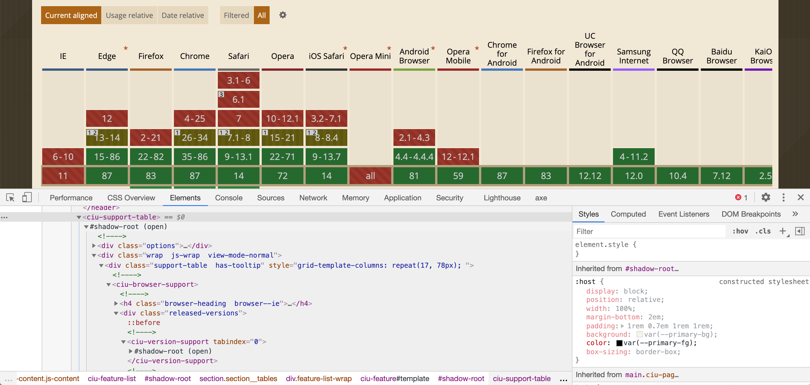

slide-transition: true
# **Web components** through the eyes
# of a newcomer
### Design 4 Drupal - December 2, 2020
### [https://bit.ly/d4dwc](https://bit.ly/d4dwc)

---

[.column]
## Brian Perry
* Front End Architect at Bounteous
* Rocking the Chicago ‘burbs
* Lover of all things components... and Nintendo

@bricomedy

[.column]


---


^ Special shout outs:
* Andy Olsen for helping me crack the code on this talk
* Also NEDCamp BOF Session

---

# [fit] Components
# [fit] have taken over the web


---

# We're here to talk about
# [fit] Web
# [fit] Components

---

## [fit] Like React and Angular, right?

---
[.build-lists: true]

# Web components

__A set of web platform APIs__, not tied to a specific framework

* Custom elements
* Shadow DOM
* HTML Templates

---
# I :heart: components.
<br>
# So I should :heart: Web Components.
<br>
# So why aren't they part of my workflow? :cold_sweat:

---
# [fit] Warning: not an expert


---

# I look to:

[.column]


### @btopro

[.column]


### [fit] @salem_cobalt

[.column]


### [fit] @castastrophee

[.column]


### @illepic

---

## Can I Use Web Components? [^1]


[^1]: IE 11 can be supported using polyfills

---

# [fit] Can Can I Use Use Web Components? [^2]



[^2]: Find many more examples at https://wild.open-wc.org/

---

# I should build an example web component.
<br>
But what could be a relevant example in November 2020?

---


---


^ Hitting reload... over... and over...

---


---


---


---


---


---


^ I see the NY Times tracker as the definitive example - so let's make that.

---
## My own personal election tracker


^ Pretty close, right?

---

# Using <election-tracker>

* Import script as JS module. Could be:
  * local file
  * NPM dependency (@backlineint/results-tracker)
* Use your custom element in markup
* Pass data in using attributes

Note: If your component has external dependencies, you'll need to use a bundler (Webpack, Rollup, Parcel, etc.)

---

## Custom Elements [^3]


[^3]: [https://codepen.io/brianperry/pen/RwGPLBx](https://codepen.io/brianperry/pen/RwGPLBx)

^ Click over to pen
* Note unpackage module imports
* Custom element tag results-tracker
* Pass in attributes - these are strings
* Update attributes and watch component update
* Candidates array is funky - better way to do this?
* <p>Is a slot - we'll cover that later (maybe?)

---
[.build-lists: true]
# Shadow DOM

* Encapsulated DOM Tree
* Separate from main DOM
* Elements won't collide
* Scoped styles
* Super spooky


---

# Scoped Styles [^4]


[^4]: [https://codesandbox.io/s/election-results-tracker-wdxvx?file=/src/styles.css](https://codesandbox.io/s/election-results-tracker-wdxvx?file=/src/styles.css)

^ Here are some examples of global styles interacting with scoped styles.

---
[.build-lists: true]

# Global Styling

TBH, I'm still confused :confused:

* CSS Inheritance
* CSS custom properties (css variables)
* CSS ::part
  * `<div part="headline">`
  * `results-tracker::part(headline) { color: red; }`
* Opt out of the shadow DOM

^ Many options, but the exact combination is still unclear.
* Inherrited styles work, but only inherrited styles.
* CSS custom properties pierce the shadow DOM but are more appopriate for theming.
* Part alows you to target part of the shadow DOM with CSS
* Opting out of shadow DOM forces you to use global styling (but also give up some features.)


---
# [fit] Building <election-tracker><br>Take 1: Vanilla JS

---

Rendering a Headline
index.html

```html
<html>
  <head>
    <title>Results Tracker Heading</title>
    <meta charset="UTF-8" />
  </head>

  <body>
    <results-tracker headline="Race Between Old Men Too Close To Call" />

    <script type="module" src="src/results-tracker.js"></script>
  </body>
</html>
```

---

results-tracker.js

```javascript
class ResultsTracker extends HTMLElement {
  constructor() {
    // Always call super first in constructor
    super();

    // Create a shadow root
    const shadow = this.attachShadow({ mode: "open" }); // sets and returns 'this.shadowRoot'

    // Create wrapping element
    const wrapper = document.createElement("div");
    wrapper.setAttribute("class", "results-tracker");

    this.headlineElement = document.createElement("h2");
    this.headlineElement.setAttribute("class", "results-tracker__headline");
    this.headlineElement.textContent = this.getAttribute("headline");
    wrapper.appendChild(this.headlineElement);

    // Attach the results tracker to the shadow DOM.
    shadow.appendChild(wrapper);
  }
}

// Define the new element
customElements.define("results-tracker", ResultsTracker);
```

^ Shadow root open means you can access it in the main page context
* Really miss templating here.

---

Refactoring to use <template>

```javascript
class ResultsTracker extends HTMLElement {
  constructor() {
    super();
    this.shadow = this.attachShadow({ mode: "open" });

    // Templates are not referenced in the DOM, but can be referenced / cloned using js
    const template = document.createElement("template");

    template.innerHTML = `
      <div class="results-tracker">
        <div class="results-tracker__headline">
          <h2>${this.getAttribute("headline")}</h2>
        </div>
      </div>
    `;

    // Attach the template to the Shadow DOM
    this.shadow.appendChild(template.content);
  }
}

customElements.define("results-tracker", ResultsTracker);
```

^ <template> is not referenced in the DOM, but can be referenced using js.
* Could add it in HTML, but that kind of defeats the purpose of an encapsulated component.

---

Add scoped styling

```javascript
class ResultsTracker extends HTMLElement {
  constructor() {
    super();
    /* Removed for brevity... */

    // Create CSS to apply to the shadow dom
    const style = document.createElement("style");

    style.textContent = `
      :host {
        font-family: 'Libre Franklin', helvetica, arial, sans-serif;
      }
      h2 {
        margin: .5rem 0;
        font-family: 'Domine', serif;
        font-weight: 700;
        font-size: 36px;
        text-align: center;
      }
    `;

    // Attach the styles to the shadow dom
    shadow.appendChild(style);

    /* Removed for brevity... */
  }
}
```

---

Observe attributes and re-render if changed

```javascript
class ResultsTracker extends HTMLElement {
  // Specify observed attributes for attributeChangedCallback
  static get observedAttributes() {
    return ["headline"];
  }

  constructor() {
    /* Removed for brevity */
  }

  // Custom element lifecycle callback function
  attributeChangedCallback(name, oldValue, newValue) {
    // Compare old to new to prevent unnecessary re-rendering
    if (oldValue !== newValue && name === "headline") {
      this.shadow.querySelector(
        ".results-tracker__headline h2"
      ).textContent = newValue;
    }
  }
}

// Define the new element
customElements.define("results-tracker", ResultsTracker);

```

---

# [fit] That was too much work for a headline...[^5]
# [fit] Shouldn't this be easier?


[^5]: [https://codesandbox.io/s/results-tracker-heading-vanilla-js-lunes](https://codesandbox.io/s/results-tracker-heading-vanilla-js-lunes)

---

# [fit] Wait for it...

---
# [fit] So.
# [fit] Many.
# [fit] Libraries.

---

* LitElement
* Stencil
* FastElement
* Haunted
* Hybrids
* Many more...

# Aren't we just back where we started?

^ I've seen some debate about if they were even intended to be used without a library.
* MS / Google investing here - that has to mean something.

---
Only one way to find out...
<br>

<br>
# [fit] Building <election-tracker><br>Take 2: Lit-Element

---

Rendering a headline (LitElement version)
index.html

```html
<html>
  <head>
    <title>Results Tracker Heading - Lit</title>
    <meta charset="UTF-8" />
  </head>

  <body>
    <results-tracker headline="Race Between Old Men Too Close To Call" />

    <script type="module" src="src/results-tracker.js"></script>
  </body>
</html>
```

(same as vanilla js version)

---

results-tracker.js

```javascript
import { LitElement, html } from "lit-element";

export class ResultsTracker extends LitElement {
  static get properties() {
    return {
      headline: { type: String }
    };
  }

  render() {
    return html`
      <div class="results-tracker">
        <div class="results-tracker__headline">
          <h2>${this.headline}</h2>
        </div>
      </div>
    `;
  }
}

window.customElements.define("results-tracker", ResultsTracker);
```

---

# A lot with less

* Renders custom element
* Templating
* Observes updates to attributes

Just need to add scoped styles.

---

Add scoped styling

```javascript
import { LitElement, html, css } from "lit-element";

export class ResultsTracker extends LitElement {
  static get styles() {
    return css`
      :host {
        font-family: "Libre Franklin", helvetica, arial, sans-serif;
      }
      .results-tracker__headline h2 {
        margin: 0.5rem 0;
        font-family: "Domine", serif;
        font-weight: 700;
        font-size: 36px;
        text-align: center;
      }
    `;
  }

  // Properties...

  // Render method...
}

window.customElements.define("results-tracker", ResultsTracker);
```

---

Converting attributes

```javascript
// Vanilla JS - have to manually transform string attributes
processCandidates() {
    this.candidates = JSON.parse(this.getAttribute('candidates'));
    // ...
}

// Define the type of your property, and LitElement will automatically
// handle conversion for you.
static get properties() {
  return {
    /**
     * An array of objects containing data for each candidate
     */
    candidates: {type: Array},
  };
}
```
(And many other DX niceties)

---

Feels like a more appropriate amount of work for a headline... and especially the full results-tracker [^6]


[^6]: [https://codesandbox.io/s/election-results-tracker-thk26](https://codesandbox.io/s/election-results-tracker-thk26)

^ That was a more appropriate amount of work for a <results-tracker>

---
# Stencil

> Compiler that generates web components

Provides extra capabilities on top of Web Components:

* Prerendering
* Objects-as-properties
* Virtual DOM
* JSX
* Async Rendering


---

# Vue

Supports web components as a build target.

But...

It still requires the Vue library as a global dependency.

# :disappointed:


---

# [fit] The dog ate my homework section

---

## Using web components with a framework

[custom-elements-everywhere.com](https://custom-elements-everywhere.com/) outlines support for many frameworks.

Support is pretty solid across the board.

React has some notable limitations. :disappointed:


---

## Managing Application state

* Didn't come accross any clear pattern or best pratice.
* Could roll your own.
* Could use any JS based state management library.
* Would be nice if a default standard existsed (think React context)

---
[.build-lists: true]
# My (slightly) more educated views on web components

* This was pretty hard to learn!
* I'd turn to this for special purpose components today.
* Not yet comfortable enough for a full app/design system.
* I would use a library, but one close to the vanilla API.

---
[.build-lists: true]
# On an infinite timescale...

* I think some version of this concept will win out.
* But how infinite is that timescale?
* And will it be this take on web components?

---
At least I've got this cool election tracker.
# Thanks!

brian.perry@bounteous.com
@bricomedy
